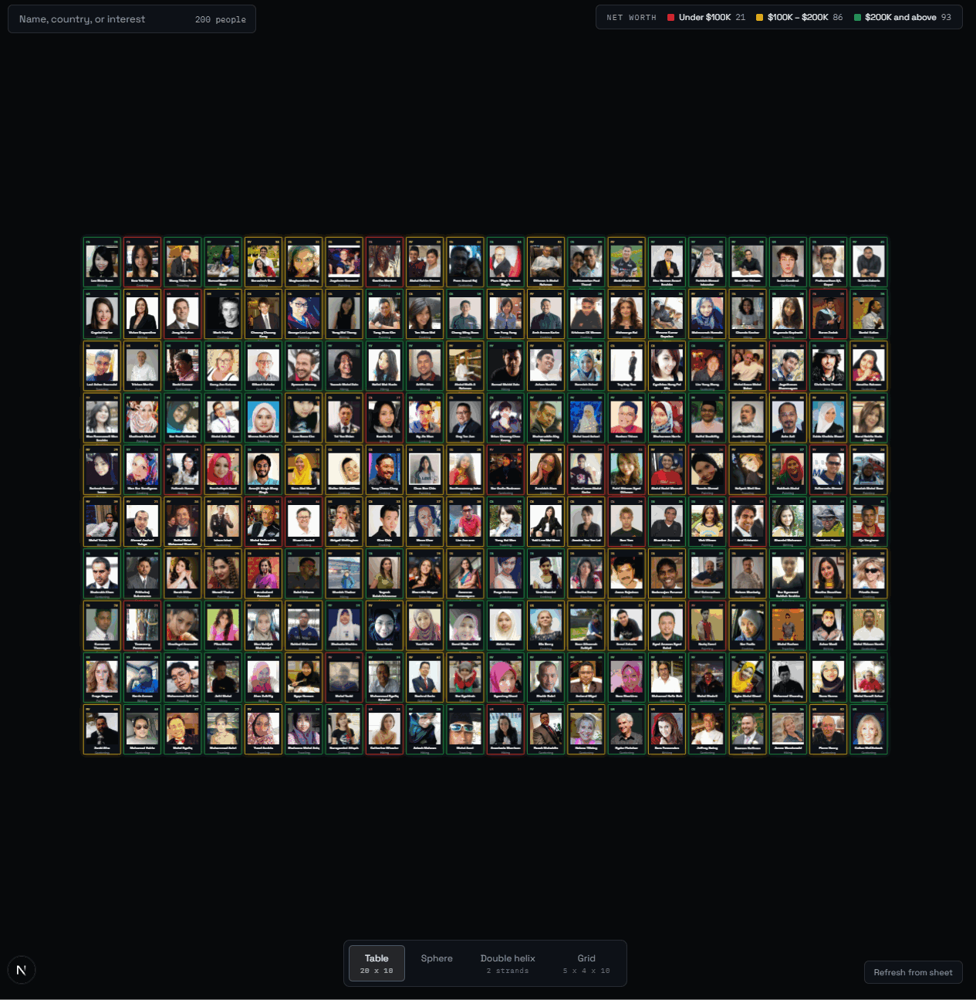
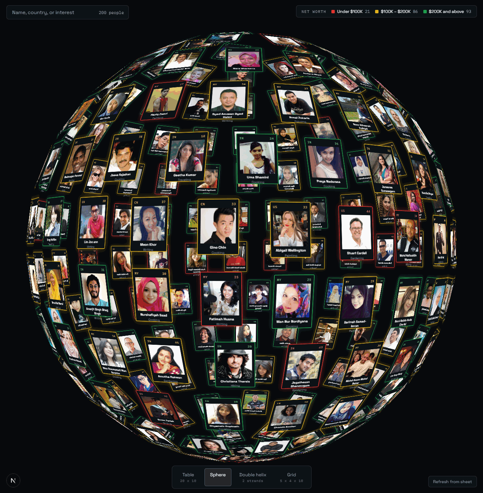
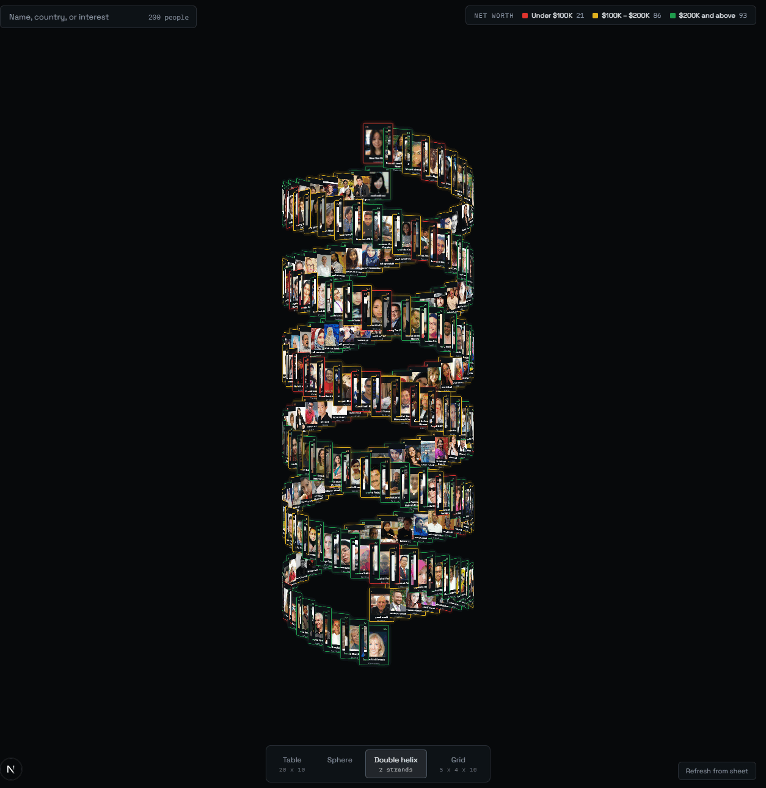
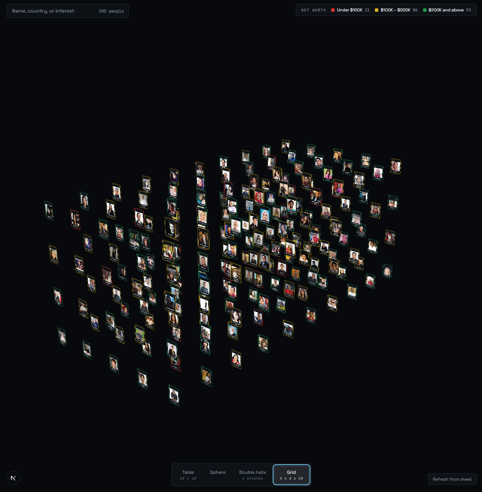
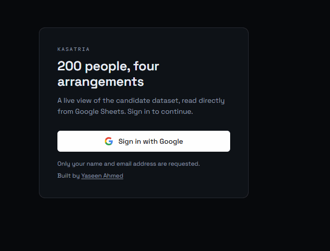

# 200 people, four arrangements

A CSS3D visualisation of 200 people, read **live from Google Sheets**, arranged
as a table, sphere, double helix, or grid.

Built from the [three.js `css3d_periodictable`](https://threejs.org/examples/#css3d_periodictable)
example for the Kasatria Software Developer internship assessment.

**Live:** <https://kasatria-people-viz.vercel.app>

---

## The four arrangements

| Table — 20 × 10 | Sphere |
|---|---|
|  |  |
| **Double helix — 2 strands** | **Grid — 5 × 4 × 10** |
|  |  |

Tile colour encodes net worth throughout; the legend counts update with the
data. The layout buttons carry their own dimensions, so the graded numbers are
visible in the UI as well as in the tests.

### Double helix — two interleaved strands

Two strands, 180° out of phase, rising in lockstep. Tiles alternate between
strands by parity rather than splitting the dataset in half, so the country
grouping in the source data distributes evenly across both ribbons instead of
landing entirely on one. The strands are hard to separate visually from a
static angle — they are verified by test instead: `tests/layouts.test.ts`
asserts that paired tiles sit at equal height, diametrically opposite, and on
the cylinder surface.

### The sign-in gate



An unauthenticated visitor never receives the dashboard bundle — the session is
resolved in the server component, so this is not a client-side conditional.

---

## Requirements checklist

| # | Requirement | Where it lives |
|---|---|---|
| 1 | Sheet imported from CSV, shared with `lisa@kasatria.com` | — |
| 2 | Google Sign-In gate | `src/auth.ts`, `src/app/page.tsx` |
| 3 | Data retrieved from the Google Sheet | `src/lib/sheets/client.ts` |
| 4 | Tiles match Image B (photo, name, country, age, interest) | `src/scene/tile.ts` |
| 5 | Colour by net worth — red / orange / green | `src/lib/netWorth.ts` |
| 6 | Four arrangements | `src/scene/layouts/` |
| 7 | Table exactly **20 × 10** | `src/scene/layouts/table.ts` |
| 8 | **Double** helix, not single | `src/scene/layouts/doubleHelix.ts` |
| 9 | Grid exactly **5 × 4 × 10** | `src/scene/layouts/grid.ts` |

Requirements 7–9 specify exact dimensions, so they are **verified by tests**
rather than by eye — see [Testing](#testing).

---

## Architecture

```
Browser                    Next.js server                 Google
────────                   ──────────────                 ──────
SignInScreen ──────────▶  Auth.js (OAuth) ─────────────▶  Google Identity
                                │
                                ▼
page.tsx (server) ─────▶  loadPeople()
  │                            │  1. TTL cache (60s)
  │                            │  2. fetch ──────────────▶  Sheets API v4
  │                            │  3. validate + normalise      (API key,
  │  initial data as props     ▼                                server-side)
  ◀──────────────────────  Person[] (typed, clean)
  │
  ▼
PeopleDashboard             (same service)
  │  "Refresh from sheet"        ▲
  └──────────────────────▶  GET /api/people
                                 │  auth() → 401 if signed out
  SceneCanvas ──▶ PeriodicScene (three.js, no React)
```

### Why a backend at all

The assignment does not require one. But fetching Sheets **directly from the
browser ships the API key to the client**, where anyone can lift it from
DevTools and exhaust the project's quota.

A thin backend-for-frontend fixes that and earns four more things:

- **Secret containment** — the key exists only in `src/lib/sheets/client.ts`, server-side.
- **One validation boundary** — rows are parsed and validated once, so the client only ever receives well-formed data.
- **Caching** — 200 rarely-changing rows, cached for 60s, so a reviewer refreshing repeatedly cannot trip Google's rate limit.
- **Real authorisation** — the *data* is gated, not just the UI.

### Why the initial data load is server-side

The obvious approach is a `useEffect` in the dashboard that fetches
`/api/people` on mount. That means every visitor watches a spinner while their
browser makes a round trip to *our own server*, which then makes the same call
`page.tsx` could have made directly.

Instead, the server component loads the data and passes it down as props, so
the first paint already has all 200 people. `/api/people` remains — it serves
the user-initiated "Refresh from sheet" button, and it is the auditable proof
that the data endpoint itself is gated.

Both paths call the same `loadPeople()` service and share one cache. Two
independent fetch-and-normalise implementations would drift, and the drift
would show up as the page and a refresh disagreeing about the data.

### Why the 3D layer is not React

`CSS3DRenderer` wraps **real DOM nodes** and mutates their transforms
imperatively every frame. Putting 200 such tiles under React's reconciler means
fighting the virtual DOM for no benefit — React never needs to re-render a
tile, since only a CSS transform changes. React Three Fiber does not apply
either: it targets WebGL, not the CSS3D renderer.

So `src/scene/` contains **zero React imports**. React owns the shell; the
scene owns the canvas; `SceneCanvas.tsx` is the single bridge. That separation
is also what makes the layout and camera maths unit-testable without a browser.

The one place the shell needs to *command* the scene is "Reset view", and it
does so through a deliberately narrow imperative handle rather than a prop.
Resetting is an event, not state; modelling it as a prop would mean inventing a
counter whose value is never read. Everything that genuinely is state — data,
layout, visibility — still flows one way.

### What I deliberately did not build

- **A database.** The Sheet is the single source of truth and holds 200 rows. Postgres would add a sync problem that does not currently exist, plus migrations and a deploy dependency, to cache data that fits in memory.
- **Middleware auth.** See [SECURITY-NOTES.md](./SECURITY-NOTES.md).
- **Pagination / sorting / a table view.** Not in the brief. The brief asks for four 3D arrangements.

---

## Security

| Concern | Handling |
|---|---|
| Sheets API key | Server-side only; never prefixed `NEXT_PUBLIC_`. Verify with DevTools → Network. |
| Data endpoint | `auth()` inside the route handler, **not** middleware — CVE-2025-29927 makes middleware-only checks bypassable. |
| OAuth scopes | `openid email profile` only. The user's account is never used to read the Sheet. |
| Sheet content | Treated as untrusted input: `textContent` never `innerHTML`; photo URLs restricted to `http(s)` so `javascript:` and `data:` are rejected. |
| Upstream errors | Google's error bodies can echo the request URL (which contains the key) and are never forwarded to the client. |

```bash
# The data endpoint rejects unauthenticated requests:
curl -i https://kasatria-people-viz.vercel.app/api/people   # → 401 {"error":"Sign in to view this data."}
```

---

## Data handling

The supplied CSV has defects that a naive import silently propagates. All are
handled at the ingestion boundary and covered by tests:

| Defect | Consequence if ignored | Handling |
|---|---|---|
| File is ISO-8859/cp1252, not UTF-8 | Mangled characters on import | Import as cp1252 (see [Setup](#setup)) |
| Header is `" Net Worth "` — with surrounding spaces | Header-name lookup returns `undefined`; every tile renders red | Read by **column position**, not name |
| Two names end with U+00A0 (non-breaking space) | Visibly off-centre name; exact-match search fails | Explicit Unicode-aware trim |
| `Number("")` is `0`, not `NaN` | A blank age renders as a person aged 0 | Explicit emptiness check before coercion |
| Sheets omits trailing empty cells | Short rows crash on index access | `noUncheckedIndexedAccess` + row-length tolerance |

**Partial failure by design:** one malformed row never blanks the page. Invalid
rows are collected, reported in the UI, and the remaining people still render.

### A spec ambiguity, resolved and documented

The brief says *red < $100K, orange > $100K, green > $200K* — which leaves
**exactly** $100,000 and **exactly** $200,000 in no bucket at all. A person at
exactly $200,000.00 would render with no colour.

Resolved so the ranges are contiguous and total:

```
low  (red)    netWorth <  100,000
mid  (orange) 100,000 ≤ netWorth < 200,000
high (green)  netWorth ≥ 200,000
```

No value in the supplied dataset sits on a boundary, so this changes nothing
today — it makes the code correct for data that arrives tomorrow.

Current distribution: **21 low · 86 mid · 93 high**.

---

## Testing

```bash
npm run test        # 92 tests
npm run verify      # typecheck + lint + test
```

The layout functions return inert position data rather than mutating
`THREE.Object3D`s, which makes the spec's exact numbers directly assertable:

```ts
it("is 5 wide",  () => expect(new Set(grid.map(p => p.x)).size).toBe(5));
it("is 4 tall",  () => expect(new Set(grid.map(p => p.y)).size).toBe(4));
it("is 10 deep", () => expect(new Set(grid.map(p => p.z)).size).toBe(10));
```

The double helix is asserted on its defining properties — paired tiles at
equal height, diametrically opposite, on the cylinder surface — rather than on
a screenshot.

### Camera framing is tested the same way

Camera distance started life as four hardcoded constants, and it was wrong in a
way no screenshot from one machine would reveal: the correct distance depends on
the **viewport aspect ratio**, so a value that framed all 20 table columns on a
wide monitor sliced the outer ones off a narrower window — on the exact layout
whose 20 × 10 shape a reviewer is asked to count.

So `src/scene/camera.ts` derives the distance from the layout's bounding box and
the live aspect ratio, and `tests/camera.test.ts` asserts the property that
matters across four viewport shapes: every bounding-box corner and every tile
centre projects inside the frustum. The test builds its view basis from a
look-at direction rather than reusing the module's own, so a sign error cannot
hide behind the same sign error in the test.

### One more test earns its keep

One test exists specifically to catch the off-by-one the original demo invites:
its grid advances a layer every 25 tiles, and changing the row count to 4
without also changing that divisor produces a face that *looks* right from the
front while tiles wrap into the wrong layers behind it.

---

## Setup

**Prerequisites:** Node ≥ 20.9

```bash
npm install
cp .env.example .env.local   # then fill it in
npm run dev
```

### 1. Google Sheet

Import `Data Template.csv`, **selecting Windows-1252 / Western encoding** — the
file is not UTF-8. Name the tab `People`. Share with `lisa@kasatria.com`.

### 2. Google Cloud

1. Enable the **Google Sheets API**.
2. **OAuth consent screen** → External → scopes `openid`, `email`, `profile` only.
3. **OAuth Client ID** → Web application:
   - Origins: `http://localhost:3000`, `https://<deployment>`
   - Redirect URIs: `http://localhost:3000/api/auth/callback/google`, `https://<deployment>/api/auth/callback/google`
4. **API key** → restrict to the Sheets API. Do **not** add an HTTP-referrer
   restriction: the key is used server-side, where there is no referrer, so a
   referrer restriction would break it.

### 3. Environment

```bash
AUTH_SECRET=            # openssl rand -base64 32
GOOGLE_CLIENT_ID=
GOOGLE_CLIENT_SECRET=
GOOGLE_SHEETS_API_KEY=
GOOGLE_SHEET_ID=        # from the sheet URL
GOOGLE_SHEET_RANGE=People!A2:F
SHEETS_CACHE_TTL_MS=60000
```

---

## Stack

| | | Why |
|---|---|---|
| Next.js 16 | App Router, Turbopack | One repo for UI and BFF; no CORS between them |
| TypeScript | `strict` + `noUncheckedIndexedAccess` | Sheet rows are indexed constantly; forces real bounds handling |
| Auth.js v5 | JWT sessions | Google OAuth with **no database** |
| three.js | `CSS3DRenderer` | The renderer the assignment's demo is built on |
| Zod | Upstream + env validation | Fail fast at startup, not mid-request |
| Vitest | Pure-logic tests | Proves the spec's exact numbers |

### Accessibility

Tiles carry `role` and `aria-label`; the detail panel manages focus and closes
on Escape; result counts are announced via `aria-live`; `prefers-reduced-motion`
is honoured in both CSS and the scene's tweens. Colour is never the sole
carrier of information — the numeric net worth is always available, and the
three tiers differ in lightness as well as hue.
